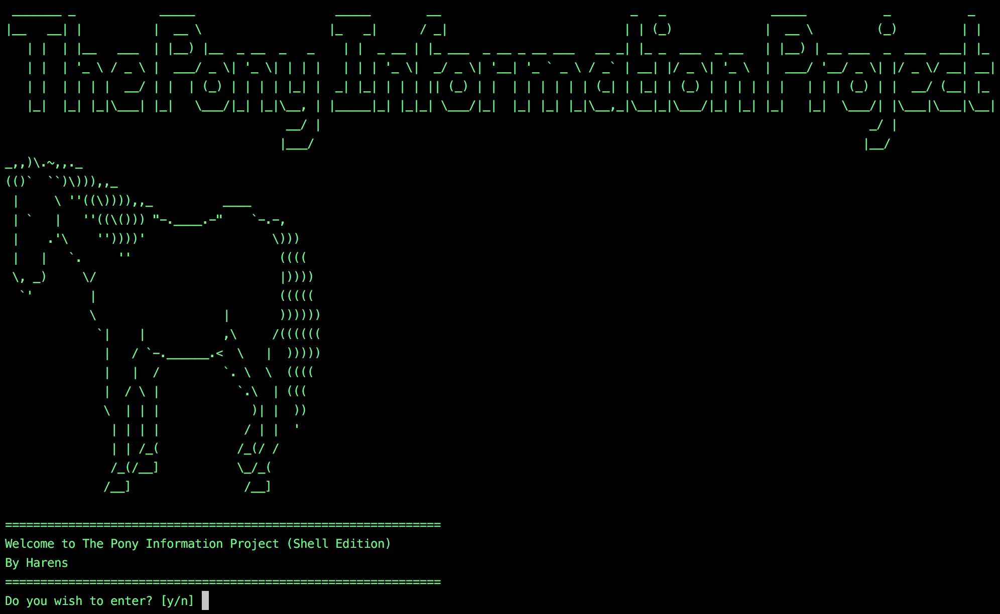

## Creative Project Blog


### The Pony Information Project

The Pony Information Project aims to educate all about ponies. It now comes in two different forms, the [Website](https://harens.github.io/ThePonyInformationProject/) and the [Shell Edition](https://github.com/harens/ThePonyInformationProject/tree/Shell-Edition). The Shell Edition was created specifically for the Creative Project.
<!--Markdown Image Format could not be used, for image would not display on website-->


#### Inspiration

##### Website

I decided to build The Pony Information Project (then known under a different name) since we were learning about HTML and CSS in class. The idea of writing about ponies may seem quite random, but even though I've never ridden a horse/pony before, I have always found them quite interesting animals.

##### Shell Edition

For the Creative Project, I was at first unsure of what to do. I considered writing an application in [Swift](https://swift.org), but this would take too long. I thought about building another website, but I already had a lot of experience with this, and wanted to try something different.

The idea of doing a scripting language came after I played a few retro games in the terminal. It's pretty easy to do on Mac OS. First you type

```
emacs
```
_Note: To anyone who's interested, GNU emacs is a very interesting text editor. You can find out more [here](https://www.gnu.org/software/emacs/)_

Then, you hit the escape key, press x, and then enter a game.

I then realised that bringing ponies to the terminal is certainly an original idea, and was very well possible within the time range.

There are numerous scripting languages that one can use. The most obvious choice would be [Python](https://www.python.org). However, for me, Python didn't seem creative enough. At the other end of the spectrum, you have less popular languages such as [REXX](http://www.rexxla.org) and [Tcl](https://www.tcl.tk), but they would take too long to learn. That is why I chose [Shell](https://www.shellscript.sh).

Choosing the theme for the scripts was an easy choice, since I had already done a website on ponies.

#### Timeline

Due to the Shell Edition moving from an independent repository to a branch of The Pony Information Project, there are two different links for commits.

* Click [here](https://github.com/harens/PonyInfoGuide-ShellEdition/commits/master) for the first 90 commits of the Shell Edition. This is between the 28th and the 30th of April.

* Click [here](https://github.com/harens/ThePonyInformationProject/commits/master) for the commits of both the Website and the Shell Edition branch.

#### Languages Utilised

* **[HTML](https://developer.mozilla.org/en-US/docs/Web/HTML)** - HTML is used to provide the foundations of the website.
* **[CSS](https://developer.mozilla.org/en-US/docs/Learn/CSS)** - Used to present the website.
* **[Javascript](https://developer.mozilla.org/en-US/docs/Learn/JavaScript)** - Only used for one 'back-to-top' button. Reason being is that I do not know the language that well.


* **[Shell](https://www.shellscript.sh)** - Shell scripts (or more specifically, [bash scripts](https://www.gnu.org/software/bash/)) were used to build the Shell Edition.
* **[Git](https://git-scm.com)** - Currently, Git is required to install the program.


* **[GFM](https://github.github.com/gfm/)** - GitHub-Flavoured Markdown was used for any form of write-up on both editions. One notable example of its use is the making of this website!

#### Programs Used

* **[iTerm2](https://www.iterm2.com)** - Terminal emulator used to test the Shell Edition.
* **[Atom](https://atom.io)** - The main text editor that was used. It was utilised to edit both versions of The Pony Information Project.
*  **[GitHub Desktop](https://desktop.github.com)** - Though it is possible to pull, push and fetch from Atom, this was the preferred program of choice.
* **[Vim](https://www.vim.org)** - Vim was used to quickly create and edit testing files from the terminal.

#### Operating Systems Tested On

The Pony Information Project Shell Edition was tested on two UNIX-like systems:

* **[MacOS Sierra](https://www.apple.com/lae/macos/high-sierra/)**
* **[Debian 9](https://www.debian.org)** (Stretch)

#### Sources and Acknowledgements
Any references and honourable mentions can be found [here](https://github.com/harens/ThePonyInformationProject/tree/master#contributors-and-resources).

#### Other
For more information about this The Pony Information Project, please click [here](https://github.com/harens/ThePonyInformationProject/tree/master#the-pony-information-project-).
